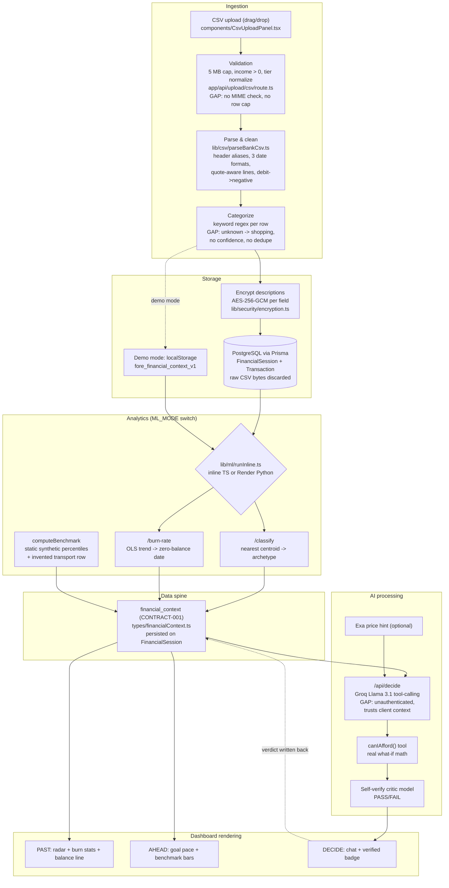

# 06 — Data Pipeline

The complete path from CSV to dashboard, as implemented, with gaps flagged inline.

## Pipeline diagram

## Stage-by-stage detail

### 1. CSV upload
`components/CsvUploadPanel.tsx` (drag/drop, keyboard accessible) posts multipart to
`POST /api/upload/csv` (full-stack) or parses in the browser (demo mode) — the same
`parseBankCsv` module runs in both places.

### 2. Validation
`app/api/upload/csv/route.ts`: file field required, **5 MB cap** (L12, L37–38),
`monthlyIncome` finite-positive (L41–44), city tier normalized (L46). **Gaps:** no
MIME/extension enforcement (client-side `accept=".csv"` only), no parsed-row cap, no
duplicate-statement detection.

### 3. Cleaning & parsing
`lib/csv/parseBankCsv.ts`: header-alias column mapping (date/narration/debit/credit/amount
for HDFC/ICICI/SBI-style exports), quote-aware line splitting, ₹/comma stripping, three date
formats normalized to ISO, debit→negative / credit→positive, rows skipped on bad date or zero
amount with a `skippedRows` count and a <10-transactions warning.

### 4. Feature engineering
Minimal and implicit: monthly category ratios ÷ income built inside the classifier
(`ml-service/classify.py` L70–105); daily end-of-day balance series inside burn-rate
(`ml-service/burn_rate.py` L61–70); monthly category spend ÷ hardcoded 3 months inside
benchmarks (`lib/benchmark/computeBenchmark.ts` L49–56). **Gap:** no shared feature store —
each consumer recomputes from raw transactions; no recurrence/merchant features exist.

### 5. Classification
Keyword regex only, default `shopping`, credits → `income`
(`lib/csv/parseBankCsv.ts` L119–124, L182–187). Target replacement pipeline (rules → ML →
LLM assist → correction queue) is specified in
[02-hackathon-feedback-responses.md](02-hackathon-feedback-responses.md) §2.5.

### 6. Storage
`createSessionFromTransactions` (`lib/db/contextService.ts` L99–141): deactivates prior active
sessions → creates `FinancialSession` + nested `Transaction` rows (descriptions AES-256-GCM
encrypted via `txToDb`) → computes and persists archetype/burn/benchmark. Raw CSV bytes are
never written anywhere. **Gaps:** no DB transaction around create+compute (ML failure leaves a
session without analytics), no append/stacking model (each upload replaces the active view),
per-transaction lineage (source file/row, classifier version) not recorded.

### 7. AI processing
`POST /api/decide`: system prompt embeds the spine summary (income, archetype, burn, goal,
benchmark — **not** transaction rows), optional Exa price hint, forced `canIAfford` tool call,
second completion with tool result, critic self-verify, deterministic fallback without a key.
**Gaps:** unauthenticated; context and transactions are client-supplied instead of loaded
server-side by `session_id`.

### 8. ML inference
`callMl` (`lib/api/mlServer.ts`) → inline TS (`lib/ml/runInline.ts`) or Render FastAPI with a
5s timeout, chosen by `ML_MODE`/`RENDER_ML_BASE_URL`. Classify + burn-rate run in parallel
(`Promise.all`) both server-side (`contextService.ts` L58–63) and client-side
(`lib/api/pastClient.ts`).

### 9. Analytics generation & write-back
Results are written to the spine (session row or provider state), honoring the "no face shows
a number without writing it back" rule; DECIDE verdicts PATCH `/api/context` and update the
AHEAD goal pace via `applyDecideVerdict` in the provider.

### 10. Dashboard rendering
`FinancialContextProvider` hydrates from `/api/auth/me` (full-stack) or localStorage (demo);
PAST/AHEAD/DECIDE all render from the same `ctx` object. Chart-level issues are in
[09-charts-audit.md](09-charts-audit.md).

## Priority pipeline fixes

1. Server-side context for `/api/decide` (load by authenticated `session_id`; stop trusting
   client data) — security and correctness in one change.
2. Wrap session creation + analytics in a Prisma interactive transaction, or mark sessions
   `pending` until analytics land.
3. Classification pipeline v2 with confidence + correction queue (the data moat).
4. Continuous ledger with statement provenance and dedupe (enables stacking + lineage).
5. MIME/row-count validation and a per-user upload rate limit.
