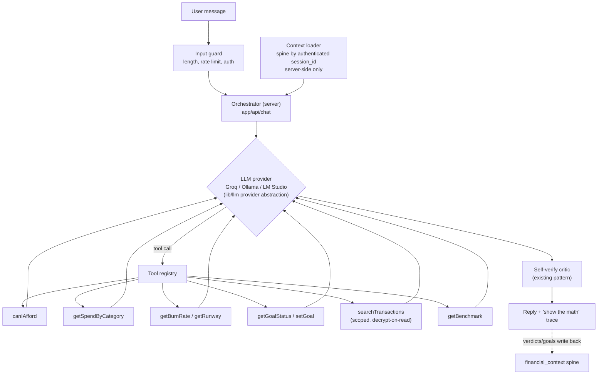

# 12 — Feature Upgrade Roadmap, AI Chatbot Design & Final Development Plan

Covers assessment sections 14 (roadmap), 15 (chatbot), and 16 (actionable development plan).
Effort is characterized by scope of change, not calendar time.

---

## 14. Prioritized upgrade roadmap

### Phase P0 — Security hardening (small, invasive nowhere, do first)

| Item | Scope | Impact |
|------|-------|--------|
| Require auth on `/api/decide`, `/api/ml/*`, `/api/voice/narrate` (demo-mode carve-out made explicit and rate-limited) | `middleware.ts` + 4 route files | Closes cost-DoS + data poisoning |
| Verify JWT signature/expiry in middleware | `middleware.ts` | Removes presence-only gating |
| Rate limiting (per-IP on auth, per-user on AI routes) | new `lib/security/rateLimit.ts` | DoS + quota protection |
| Security headers (CSP, HSTS, X-Frame-Options, Referrer-Policy) | `next.config.js` | Baseline hardening |
| zod schema on `PATCH /api/context`; userId-scope `sessionToContext`; bind `/api/auth/me` to session ownership | 3 files | Spine integrity + IDOR closure |
| Interactive transaction around session create + analytics | `lib/db/contextService.ts` | No half-initialized sessions |
| Fix login timing oracle; stop relaying upstream error text | 2 files | Info-leak cleanup |

### Phase P1 — Trust & honesty (medium scope, mostly contained edits)

| Item | Scope |
|------|-------|
| Real Google + Microsoft OAuth; delete `/api/auth/demo` stub; honest "Explore with demo data" entry ([04](04-authentication-upgrade.md)) | auth routes, schema migration, login UI |
| Server-side DECIDE context (load by authenticated session, stop trusting client arrays) | `decide/route.ts`, `DecideChat.tsx` |
| Chart honesty batch: window label, real weekly bucketing, zero-line + projected-zero marker; remove/derive the invented transport benchmark; disclose "modeled peer data" | `PastPanel.tsx`, `computeBenchmark.ts`, `BenchmarkPanel.tsx` |
| Transaction correction flow v1: transaction table + recategorize + persist per-user rules; add `confidence`/`source` columns | schema + new UI + parser changes |
| Consent + privacy surface: first-run consent, "what the AI sees" panel, export-all + delete-account endpoints | new settings area |
| TS↔Python parity CI (golden fixtures) then consolidate deterministic math inline ([11](11-scalability.md)) | `scripts/` + CI |
| Fix `docs/SECURITY.md` Groq claim; sync CONTRACT-005 labels; fix `persona-arjun`; cover all 5 personas in tests | docs + data + tests |

### Phase P2 — Real intelligence (the "not a wrapper" phase; largest ML scope)

| Item | Scope |
|------|-------|
| Trained transaction classifier (embeddings + LR head; corrections as gold labels; confidence surfaced in UI) ([05](05-ai-ml-audit.md)) | new model pipeline + serving |
| Recurring-payment/subscription detection | analytics module |
| Forecasting upgrade: seasonal decomposition + prediction intervals; UI confidence band on the runway | replaces linear OLS |
| Learned archetypes (k-means on real vectors, per-feature explanations; same `{label, distances}` contract) | `ml-service` + explanation UI |
| Real benchmarks: opt-in anonymous aggregation into `benchmark_aggregates`; synthetic tables retired | schema + jobs + consent |
| Continuous ledger with statement provenance + dedupe (data stacking/lineage) | schema migration, upload flow |

### Phase P3 — Product surface

| Item | Scope |
|------|-------|
| UI redesign ([03](03-ui-ux-audit-and-redesign.md)): foundations → shell → faces → onboarding | frontend-wide, incremental |
| Mobile-first pass + PWA ([07](07-mobile-and-pwa.md)) | frontend + service worker |
| AI chatbot (below) | new surface on existing spine |
| Local-AI hybrid mode: provider abstraction, Ollama/LM Studio, privacy toggle, self-host compose ([08](08-local-ai-hybrid.md)) | `lib/llm/` + settings |
| Proactive alerts (runway shrinking, subscription creep, anomaly spend) | jobs + notifications |

### Nice-to-have

Dark mode (re-add properly or delete `ThemeGuard` remnants), real FX rates, PNG export
re-theme, goal templates, persona comparison view, Next 15/React 19 upgrade.

### Future research

Account Aggregator (RBI framework) integration; Android SMS ingestion; agentic budget
planning (multi-step tool plans: "get me to ₹1L savings by June"); on-device
(`transformers.js`) classification; federated benchmark aggregation; Capacitor native shells.

### Prioritization logic

P0 is small and removes the risks that make everything else unshippable. P1 converts the two
loudest criticisms (fake OAuth, misleading data) into fixed facts before any marketing claim.
P2 is the moat — it's sequenced after P1 because the correction flow (P1) *generates the
training data* P2 needs. P3 is polish and reach, safe to parallelize with P2 once the
foundations exist.

---

## 15. AI chatbot integration

### Positioning — extend DECIDE, don't add a second brain

DECIDE already is a chatbot with one tool. The upgrade is a **tool registry**, not a new
subsystem — which is also how the chatbot avoids duplicating the dashboard: every number it
can cite comes from the *same functions the dashboard renders from*.

### Architecture

### Conversation flow

1. Message arrives at `POST /api/chat` (authenticated; per-user rate limit).
2. Server loads the spine + conversation summary by `session_id` — **client sends only the
   message text** (fixes today's client-supplied-context flaw).
3. System prompt: role, hard rule ("never state a financial number that did not come from a
   tool result"), spine summary, capability list.
4. LLM runs with the tool registry, `tool_choice: auto`, max N tool rounds (cap 3).
5. Each tool executes server-side against the user's own session; results injected back.
6. Critic pass verifies numbers in the narration match tool outputs (existing
   `selfVerifyReply` generalized to compare against all tool results).
7. Reply streams to the client with an expandable "show the math" trace (tool name, inputs,
   outputs); any verdict/goal change is written back to the spine so PAST/AHEAD stay in sync.

### Supported capabilities (v1)

Affordability what-ifs (existing), spend queries ("how much on food in May?"), runway/burn
questions, goal management ("set a ₹1L goal by December" → `setGoal` writes the spine),
transaction search ("what was that 4k charge last week?"), benchmark comparisons, and
explainers ("why am I an Impulsive Spender?" → per-feature contribution from the archetype
work). Out of scope v1: payments, investment advice (keep the existing disclaimer), anything
off the user's own data.

### Data access permissions

- Tools run under the authenticated user's `sid` only — the registry receives `{userId,
  sessionId}` from the verified JWT, never from model output or client input.
- Tiered access: spine summary (always) < category aggregates (always) < row-level
  transactions with decrypted descriptions (only via `searchTransactions`, result-capped,
  and disabled when the user's privacy setting says "summaries only").
- In local-only mode ([08](08-local-ai-hybrid.md)) all tiers are available since nothing
  leaves the machine; in cloud mode the descriptions tier is opt-in.

### Retrieval strategy

The dataset is small and structured — **SQL-backed tools beat vector RAG here.** Aggregates
come from indexed queries; `searchTransactions` uses merchant-token matching first, with
embedding search over encrypted-at-rest narrations as a later upgrade (embeddings computed
locally at ingest, per [08](08-local-ai-hybrid.md)). Conversation memory: last ~8 turns
verbatim (as today) + a rolling summary persisted on a new `Conversation` model — not the
`FinancialSession` Json columns, to keep chat history separable and deletable.

### Prompt orchestration

One system prompt template, versioned in code; spine summary injected as structured JSON (as
today, `decide/route.ts` L29–45); tool schemas zod-defined and shared with the runtime
validators (single source for tool args — closes today's loose `parseToolArgs`); model output
constrained to tool calls or short markdown.

### Security considerations

Prompt injection is contained structurally: tools are the only path to data, tool args are
schema-validated, tool *selection* can't escape the registry, and the critic checks the
narration against tool outputs. Add: instruction-hierarchy reminder after user content,
output length caps, no URLs/markdown-images in replies (exfiltration channel), audit log of
tool calls per conversation, and the P0 rate limits.

### Local vs cloud execution

Identical orchestration through the provider abstraction; Ollama/LM Studio for local (with a
smaller max-tool-rounds and the deterministic fallback below it), Groq for cloud. The
fallback chain — cloud LLM → local LLM → `fallbackDecide` regex+tool — means the chatbot
never hard-fails.

---

## 16. Final deliverables map & milestone plan

All sixteen requested deliverables exist across this suite:

| Deliverable | Where |
|-------------|-------|
| Executive project assessment | [00](00-executive-summary.md) |
| Architecture review | [06](06-data-pipeline.md), [11](11-scalability.md) |
| Security review | [02](02-hackathon-feedback-responses.md) §2.12, [04](04-authentication-upgrade.md) |
| Product review, competitive positioning, feature gap analysis | [02](02-hackathon-feedback-responses.md) §2.2–2.7 |
| AI/ML review | [05](05-ai-ml-audit.md) |
| UI/UX review | [03](03-ui-ux-audit-and-redesign.md) |
| Code quality + technical debt report | [10](10-codebase-audit.md) |
| Performance + scalability review | [10](10-codebase-audit.md), [11](11-scalability.md) |
| Charts review | [09](09-charts-audit.md) |
| Mobile roadmap | [07](07-mobile-and-pwa.md) |
| Next-generation architecture | [08](08-local-ai-hybrid.md), [11](11-scalability.md) diagrams |
| Prioritized implementation roadmap | this document, §14 |

### Milestones (implementation phases)

**M1 — "Safe":** all P0 items. Exit criteria: no unauthenticated AI/ML endpoint, rate limits
live, middleware verifies JWTs, headers set, spine writes validated, session creation atomic.

**M2 — "Honest":** P1 items. Exit criteria: real Google/Microsoft sign-in in production and
the demo stub deleted; every chart label matches its data; synthetic data disclosed; users can
correct categories; parity CI green; docs match code.

**M3 — "Smart":** P2 items. Exit criteria: classifier beats the keyword rules on a held-out
labeled set (macro-F1 target set once the first labeled batch exists); runway shows a
confidence band; subscriptions detected; ledger is continuous with provenance.

**M4 — "Loved":** P3 items. Exit criteria: redesigned shell + onboarding shipped; PWA
installable; chatbot answering all v1 capabilities with the "show the math" trace; local-only
mode demonstrable end to end (`docker compose up` with Ollama).

Dependencies: M1 → M2 strictly; M3 depends on M2's correction flow for training data; M4 can
start its UI tracks in parallel with M3.
